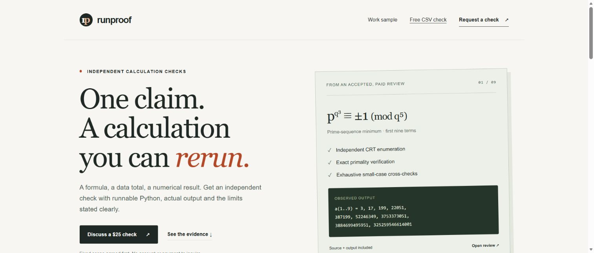

# Runproof

A small service experiment: one independently checked calculation, runnable source, actual output and stated limits. Proposed pilot price USD25; **no customer order or revenue yet**.

Rendered preview of this project's own service page. The [public HTTPS demo](https://runproof.allisonqq.chatgpt.site) was published through Sites on2026-10-02. Its four runtime files are copied unchanged from this project's verified source. Publication succeeded independently of a local server or tunnel; no new public-browser interaction test is claimed. The earlier temporary tunnel address is no longer available.

The free CSV tool runs locally in the browser. It checks one decimal column against an optional expected total and generates a file-hash-bound Python verifier. It does not validate an entire dataset or infer whether duplicate records are errors.

## Supported input

- UTF-8 comma-separated CSV, optional BOM, one unique header row.
- At most 2 MiB, 20,000 data records and 64 columns.
- Plain decimals only (maximum 64 digits, 18 fractional digits); no thousands separators, currency symbols or scientific notation.
- Invalid or empty amounts block the total rather than being silently dropped. Optional ID-column checks identify empty or repeated IDs without assuming they are mistakes.

No dependencies, analytics, data upload, persistent browser storage, payment collection or account creation. Inquiry buttons open a reviewed public GitHub issue draft or the existing X profile. Do not put confidential data in a public issue.

## Run

`npm test` tests CSV/decimal failure modes and compares exported Python results with browser-core results using Python's independent Decimal/csv implementation.

`npm run dev` serves only the page, stylesheet and two browser modules on127.0.0.1:4178. Configuration and other project files are not exposed. The source and observed previous mathematical review are linked publicly; no credentials or personal contact address are included.

For a temporary development preview, Cloudflare's official Quick Tunnel can point at that local server: `cloudflared tunnel --no-autoupdate --url http://127.0.0.1:4178 --protocol http2`. It has no uptime guarantee and is not permanent production hosting.

The website is a demand experiment. A working calculator/page is not proof of buyer demand, a paid assignment or earned money.

The software is available under the [MIT license](LICENSE). The license permits use and modification with attribution; it does not certify the accuracy of any customer's data or result.
